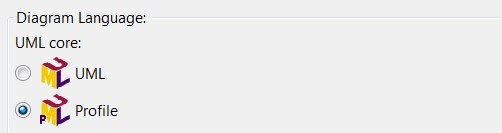

org.eclipse.papyrus.training.library.profile

---

## New Project Papyrus
 Chose Diagram Language: Profile  
 
  
  
   
 
 Add a Profile Diagram   
![Libraryergt jpg][ProfileDiagram] 

---

 Create a Stereotype with the Palette
![Libraryergt jpg][FirstStereotype]
 Import a <<Metaclass>> Class
 Create a <<Stereotype>> Book 

---

## Extension Point : org.eclipse.papyrus.uml.extensionpoints.UMLProfile  
  - Name: Name of the profile
  - Path: Path to the UML profile model
  - Qualifiednames: used to specify a subset of sub profile to apply
  - Iconpath, description, provider: icon that will be displayed in popup and other ui elements

// display runtime  
 ![Libraryergt jpg][ApplyProfile1]
 ![Libraryergt jpg][ApplyProfile2]
 
---

## Extension Point : org.eclipse.papyrus.uml.extensionpoints.UMLLibrary  
  - Name: Name of the library
  - Path: Path to the UML model
  - Iconpath, description, provider: icon that will be displayed in popup and other ui elements
  
---

// display runtime  
 ![Libraryergt jpg][ImportLibrary1]
 ![Libraryergt jpg][ImportLibrary2]
 
---

Behold the library profile ![Libraryergt jpg][LibraryProfileDiagram]  

[LibraryProfileDiagram]: /org.eclipse.papyrus.training.library.profile/doc/LibraryProfile.jpg?raw=true "Library Profile Diagram"
[ApplyProfile1]: /org.eclipse.papyrus.training.library.profile/doc/ApplyProfile1.jpg?raw=true "Apply a Profile Step1"
[ApplyProfile2]: /org.eclipse.papyrus.training.library.profile/doc/ApplyProfile2.jpg?raw=true "Apply a Profile Step2"
[ImportLibrary1]: /org.eclipse.papyrus.training.library.profile/doc/ImportLibrary1.jpg?raw=true "Import Library Step1"
[ImportLibrary2]: /org.eclipse.papyrus.training.library.profile/doc/ImportLibrary2.jpg?raw=true "Import Library Step2"
[FirstStereotype]: /org.eclipse.papyrus.training.library.profile/doc/FirstStereotype.jpg?raw=true "Create First Stereotype"
[RegisterLibrary]: /org.eclipse.papyrus.training.library.profile/doc/RegisterLibrary.jpg?raw=true "Register a Library"
[RegisterProfile]: /org.eclipse.papyrus.training.library.profile/doc/RegisterProfile.jpg?raw=true "Register a Profile"
[ProfileDiagram]: /org.eclipse.papyrus.training.library.profile/doc/ProfileDiagram.jpg?raw=true "Add a Profile Diagram"
[DiagramLanguage]: /org.eclipse.papyrus.training.library.profile/doc/DiagramLanguage.jpg?raw=true "Select Diagram Language"

